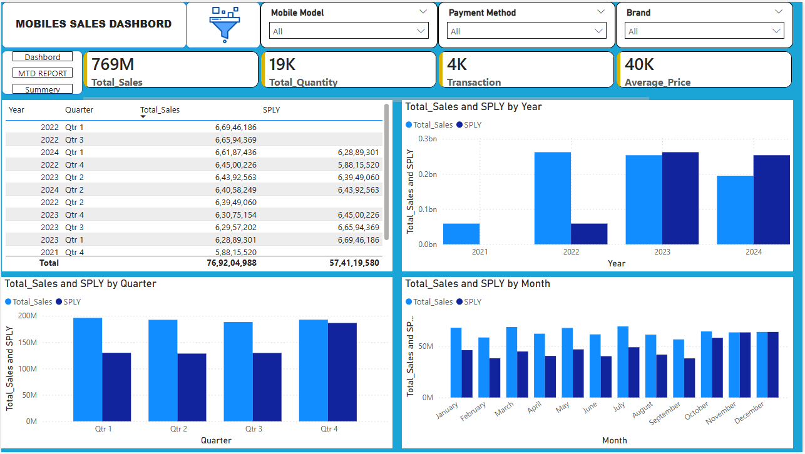

# 📱 Mobile Sales Analytics & Visualization Dashboard (Excel + Power BI)

> An end-to-end data analysis project using **Excel for data preparation** and **Power BI for data visualization and insights generation**.

---

## 📌 Project Overview

This project focuses on analyzing **mobile sales data from 2021 to 2024** to uncover trends, patterns, and business insights.

The workflow includes:
- Data storage and preparation in **Microsoft Excel**
- Data modeling and visualization in **Power BI**
- Creating interactive dashboards to support decision-making

---

## 🗂 Dataset Description

The dataset includes the following columns:

- 🆔 Transaction ID  
- 📅 Day, Month, Year, Day Name  
- 📱 Brand & Mobile Model  
- 📦 Units Sold  
- 💲 Price Per Unit  
- 👤 Customer Name & Age  
- 🌍 City  
- 💳 Payment Method  
- ⭐ Customer Ratings  

---

## 🧹 Data Preparation (Excel)

Excel was used as the database for:

✔️ Organizing raw sales data  
✔️ Structuring tables for analysis  
✔️ Ensuring consistency in column formats  
✔️ Preparing clean data for Power BI  

---

## 📊 Power BI Workflow

### 🔍 Understanding the Data
- Explored dataset structure and relationships  
- Identified key metrics and business questions  

### 📅 Custom Calendar Table
- Created a **custom Year Calendar table**  
- Enabled time-based analysis (MTD, QTD, YTD)  

### 🔗 Data Modeling
- Built relationships between tables  
- Designed a clean and efficient data model  

### 🧮 DAX Calculations
- Learned and applied DAX for the first time  
- Created calculated measures for analysis  

Examples include:
- 📆 MTD (Month-to-Date)  
- 📆 QTD (Quarter-to-Date)  
- 📆 YTD (Year-to-Date)  
- 🔁 Same Period Last Year comparison  

---

## 📈 Dashboard Features

✔️ Interactive dashboards  
✔️ KPI indicators for sales performance  
✔️ Time-based sales analysis  
✔️ Brand-wise and city-wise performance  
✔️ Customer insights  
✔️ Edited visual interactions for better storytelling  

---

## 📷 Dashboard Preview

*(Add your screenshots here)*

```markdown

[Dashboard 1](Dashbord.png)

```

---

## 🎯 Key Insights

- Identified top-performing mobile brands 📱  
- Analyzed sales trends over multiple years 📊  
- Compared current performance with previous years 🔁  
- Discovered customer purchasing patterns 🧠  
- Evaluated city-wise sales distribution 🌍  

---

## 🛠 Tools & Technologies

- 📊 Microsoft Excel (Data Storage & Preparation)  
- 📈 Power BI (Data Visualization & Dashboarding)  
- 🧮 DAX (Data Analysis Expressions)  

---

## 🚀 What I Learned

- Understanding and structuring real-world datasets  
- Building data models in Power BI  
- Writing DAX calculations for the first time  
- Creating interactive and user-friendly dashboards  
- Applying time intelligence functions (MTD, QTD, YTD)  

---

⭐ If you like this project, consider giving it a star!
